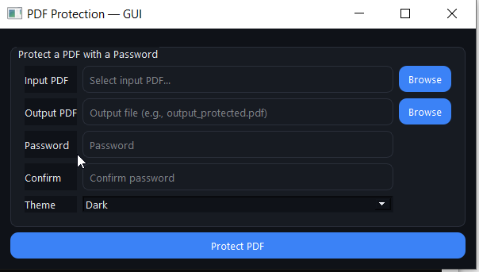
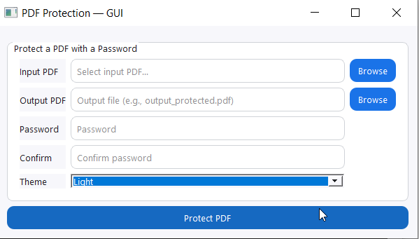

# PDF-protection
This tool helps you encrypt your pdf files with passwords, and comes with this gui.
Built with Python and PyQt5, it provides a modern graphical user interface (GUI) that allows users to easily encrypt PDF documents, ensuring sensitive information remains secure.

Features

Encrypt any PDF file with a user-defined password

Modern GUI with Dark/Light theme support

Simple file picker for input and output PDFs

Password confirmation to avoid mistakes

Fast and lightweight encryption process

 Installation

Clone the repository:
```bash
git clone https://github.com/Mikey-19/PDF-protection.git
```

Navigate into the folder:
```bash
cd pdf-protection
```

Install dependencies:
```bash
pip install -r requirements.txt
```
 Usage

Run the tool with:

```bash
python pdf-pro-gui.py
```
 GUI Overview

The PDFShield interface allows you to:

Select an input PDF file

Define an output filename for the protected PDF

Enter and confirm a password for encryption

Apply Dark or Light theme based on user preference

Encrypt and save the PDF with one click


 Screenshots

Dark Mode Example



Light Mode Example




License

This project is licensed under the MIT License – you are free to use, modify, and distribute it.


